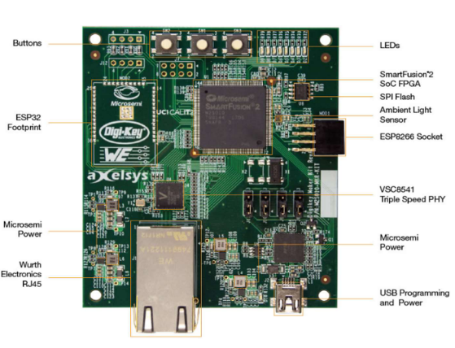

<h1 align="center">Microsemi SmartFusion2 Error Detection</h1>

  FPGA/SoC Project Implementing Linear Error Correcting Encoding
  
  

 

## 1. Introduction
As part of the course "Integrated Systems for Industry and Space Applications" in our
ECE Masters at TUM we were
introduced to the challenges and conditions that may come to exist when developing
integrated systems in space.

Besides the theoretical aspect of said course, we also had the opportunity to develop
a project on the [Microsemi SmartFusion2 Maker Kit](https://www.microchip.com/en-us/products/fpgas-and-plds/system-on-chip-fpgas/smartfusion-2-fpgas)
which should consist of both software and hardware components, as integrated
systems do!

Said project had to somewhat emulate a typical space engineering situation and do so
using as much of the resources available possible. For our project we chose to emulate
a typical scenario in Space Engineering, where communication between devices may be affected
such that from a digital point of view specific bits of a payload can be "flipped" or corrupted.

Example 16x8 pixel images are generated on the user's computer
and are manipulated following a typical [(16,11) Hamming Encoding](https://en.wikipedia.org/wiki/Hamming_code) structure.
This given error correction mechanism is able to detect up to two errors in a given payload, as well as correct one bit flip. Finally, the data is sent to the device using `UART` and done so entirely though a series of python scripts. The **MSS Microprocessr**  receives the data on an interrupt-driven mechanism, collects it, injects the necessary bit errors in a somewhat random fashion and passes it on to the **MSS Fabric** which takes care of decoding and error correction.

The communication between the processor and the Fabric is done through the `APB3 Bus Matrix`.  What this means is that within the fabric a custom APB Slave is implemented as the actual Error Correction and Detection Module. It interfaces with the processor through a peripheral called the `Fabric Interface Controller` and does so according to the APB3 Bus protocol. This facilitates communication substantially as an already existing mechanism is reused and creates a very easy abstraction to deal with both on the software and the hardware side.

## 2. Documentation
Please look at the [wiki](https://github.com/duclos-cavalcanti/microsemi-error-detection/wiki) for a detailed documentation on tool-chain and project setup!

## 3. Usage
A showcase of the project in it's use can be seen in the `gif` below:

## 4. License
This project is released under the MIT license. See [LICENSE](LICENSE).

## 5. Donations
I have a ko-fi and a buy-me-a-coffee account, so if you found this repo useful and would like to show your appreciation, feel free to do so!

---

