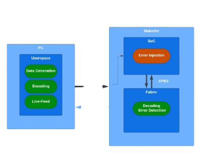

<h1 align="center">Microsemi SmartFusion2 Error Detection</h1>

  FPGA/SoC Project Implementing Linear Error Correcting Encoding
  
  

 

## 1. Introduction
As part of the course "Integrated Systems for Industry and Space Applications" in our
ECE Masters at TUM we were
introduced to the challenges and conditions that may come to exist when developing
integrated systems in space.

Besides the theoretical aspect of said course, we also had the opportunity to develop
a project on the [Microsemi SmartFusion2 Maker Kit](https://www.microchip.com/en-us/products/fpgas-and-plds/system-on-chip-fpgas/smartfusion-2-fpgas)
which should consist of both software and hardware components, as integrated
systems do!

Said project had to somewhat emulate a typical space engineering situation and do so
using as much of the resources available possible. For our project we chose to emulate
a typical scenario in Space Engineering, where communication between devices may be affected
such that from a digital point of view specific bits of a payload can be "flipped" or corrupted.

Example 16x8 pixel images are generated on the user's computer,
they are encoded through a typical [(16,11) Hamming Encoding](https://en.wikipedia.org/wiki/Hamming_code).
This given encoding is able to detect up to two errors in a given payload, as well as correct one bit flip. As per the illustration above, a given image is generated, encoded and sent to the device using `UART` and done so entirely though a series of `python` scripts. The `MSS Microprocessr`  receives the data on an interrupt-driven mechanism and collects all the data needed, injects bit errors in a somewhat random fashion and passes it on to the `Fabric` which should take care of decoding and error correction!

Please look at the [wiki](https://github.com/duclos-cavalcanti/microsemi-error-detection/wiki) for a detailed documentation on toolchain and project setup!

## 2. Usage

## 3. License
These dotfiles are released under the MIT license. See [LICENSE](LICENSE).

## 4. Donations
We have a ko-fi and a buy-me-a-coffee account, so if you found this repo useful and would like to show your appreciation, feel free to do so!

---

