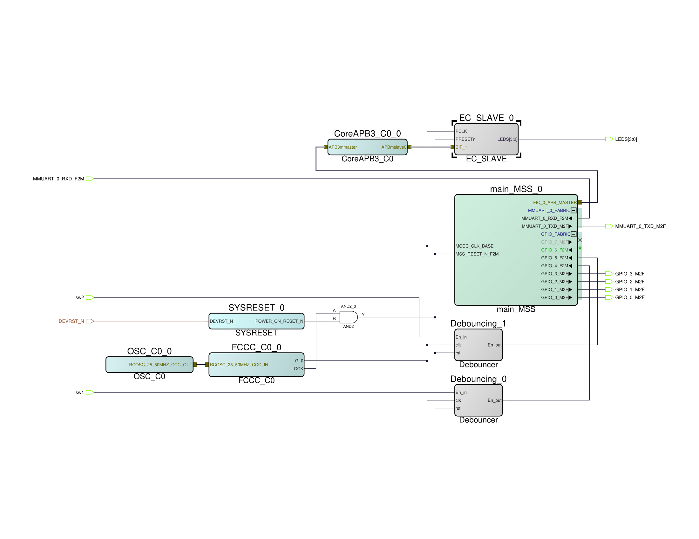

<h1 align="center">Microsemi SmartFusion2 Error Detection</h1>

  FPGA/SoC Implementation using Hamming Codes' Linear Error Correcting Encoding
  

  <!-- 
  <!--      height="500"> -->
  <!-- 
 -->
  
  

 

## 1. Introduction
Look at the [wiki](https://github.com/duclos-cavalcanti/microsemi-error-detection/wiki) for a detailed documentation!

#### TODOs
- [ ] update `SETUP.md` to a complete recreation of the project
- [ ] document images of board
- [ ] dockerfile workflow to run the microsemi software

#### Developers
- [Daniel](https://github.com/duclos-cavalcanti)
- [Ala](https://github.com/starkaf)

## 3. Installation and Setup
See [SETUP.md](SETUP.md).

## 4. Usage
### 4.1 License
1. Go to folder `~/.local/share/microsemi/license/Linux_Licensing_Daemon`
2. Start license daemon by running `./lmgrd -c ../License.dat -log ~/log.log`
3. To stop licensing daemon, go to the same location and run `./lmdown -c ../License.dat -q`

### 4.2 Libero
1. Go to folder `~/.local/share/microsemi/Libero_SoC_v2021.3/libero`
2. Run `./bin/libero`

### 4.3 Softconsole
1. Go to folder `~/.local/share/microsemi/SoftConsole-v2021.1/`
2. Run `./softconsole.sh`

## 5. Documentation
### 5.1 Manuals
- Libero: `docs/libero`.
- SmartFusion2MakerKit: `docs/smf2/`.

### 5.2 Useful Links
- [Gantt Timelines](https://www.onlinegantt.com/#/gantt)

## 6. License
These dotfiles are released under the MIT license. See [LICENSE](LICENSE).

## 7. Donations
We have a ko-fi and a buy-me-a-coffee account, so if you found this repo useful and would like to show your appreciation, feel free to do so!

---

